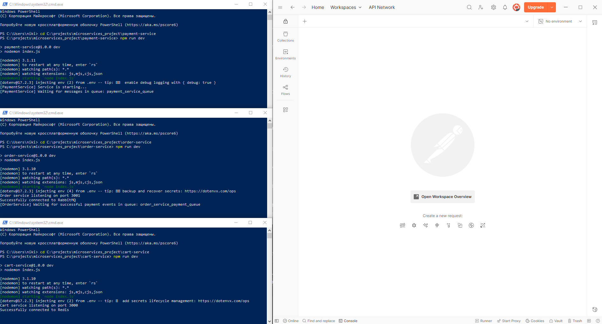
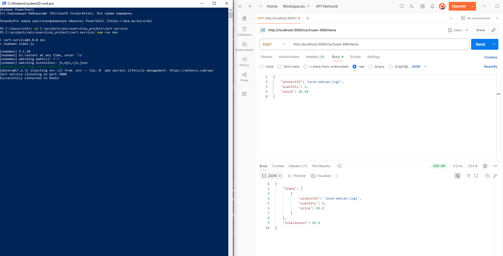
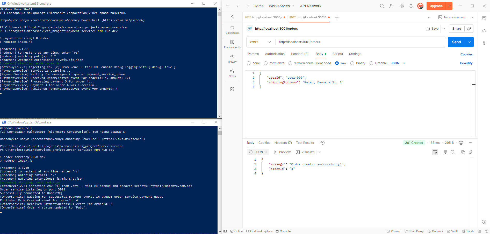

# Лабораторная работа №2: Реализация микросервисного приложения

Итоговый отчет по выполнению практической части лабораторной работы. В данном документе представлена реализованная микросервисная система для обработки заказов, а также продемонстрирован ее основной бизнес-сценарий.

## Тема и Цель работы

*   **Тема:** Разработка приложения на принципах микросервисной архитектуры.
*   **Цель:** Спроектировать архитектуру, модели данных и реализовать ключевые компоненты микросервисного приложения на основе результатов предпроектного обследования предметной области.

## Архитектура Системы

Система построена на принципах микросервисной архитектуры, где бизнес-логика разделена на независимые, слабосвязанные сервисы. Асинхронное взаимодействие между сервисами осуществляется через брокер сообщений **RabbitMQ**, что обеспечивает отказоустойчивость и масштабируемость.

### Реализованные микросервисы:

*   **Сервис Корзины (Cart Service):** Управляет временными корзинами пользователей. Хранит данные в **Redis**.
*   **Сервис Управления Заказами (Order Management Service):** Ядро системы. Принимает HTTP-запросы, взаимодействует с сервисом корзины, публикует событие `OrderCreated` и подписывается на событие `PaymentSuccessful` для обновления статуса заказа. Использует **PostgreSQL**.
*   **Сервис Платежей (Payment Service):** Обрабатывает транзакции. Подписывается на событие `OrderCreated`, имитирует процесс оплаты и публикует событие `PaymentSuccessful`. Использует **PostgreSQL**.

## Технологический стек

*   **Среда выполнения:** Node.js
*   **Веб-фреймворк:** Express.js
*   **Базы данных:** PostgreSQL, Redis
*   **Брокер сообщений:** RabbitMQ
*   **Среда контейнеризации:** Docker, Docker Compose
*   **Инструмент для тестирования API:** Postman

## Инструкция по запуску

### Предварительные требования

*   [Docker Desktop](https://www.docker.com/products/docker-desktop/)
*   [Node.js](https://nodejs.org/en/) (v16 или выше)

### 1. Запуск инфраструктуры

Вся инфраструктура (базы данных, RabbitMQ) разворачивается с помощью Docker Compose. Из корневой папки проекта выполните команду:

```bash
docker-compose up -d
```

### 2. Запуск микросервисов

Для каждого сервиса (`cart-service`, `order-service`, `payment-service`) необходимо открыть отдельный терминал, перейти в его папку, установить зависимости и запустить.

**Пример для `order-service` (повторить для всех трех сервисов):**

```bash
# Открыть новый терминал
cd order-service
npm install
npm run dev
```

## Демонстрация работы

Ниже представлены скриншоты, демонстрирующие ключевые этапы работы системы.

### Рисунок 1 - Система в состоянии готовности

На скриншоте показаны три терминала с успешно запущенными микросервисами, которые готовы к приему запросов и обработке сообщений, а также окно Postman для отправки тестовых запросов.



### Рисунок 2 - Синхронное взаимодействие: добавление товара в корзину

Демонстрация работы `cart-service`. POST-запрос на добавление товара в корзину пользователя `user-999` успешно обрабатывается, возвращая статус `200 OK` и актуальное содержимое корзины.



### Рисунок 3 - Сквозной сценарий: создание заказа и его асинхронная обработка

Это ключевой этап, демонстрирующий взаимодействие всей системы.
1.  **Postman** отправляет запрос на создание заказа для пользователя `user-999` и немедленно получает ответ **`201 Created`**.
2.  **Терминал `order-service`** показывает, что заказ `orderId: 4` был создан, после чего было опубликовано событие `OrderCreated`. Позже сервис получает событие `PaymentSuccessful` и обновляет статус заказа на `Paid`.
3.  **Терминал `payment-service`** показывает, что он "поймал" событие `OrderCreated` из очереди, симулировал обработку платежа и опубликовал ответное событие `PaymentSuccessful`.

Эта цепочка наглядно демонстрирует слабосвязанную, событийно-ориентированную архитектуру в действии.



## Выводы

В ходе выполнения лабораторной работы была успешно реализована микросервисная система, полностью соответствующая спроектированной архитектуре. Продемонстрирован ключевой бизнес-сценарий, включающий как синхронное (HTTP API), так и асинхронное (через брокер сообщений) взаимодействие между сервисами.

Выбранный подход позволил создать гибкую, отказоустойчивую и масштабируемую систему, в которой каждый сервис отвечает за свою зону ответственности и может разрабатываться и развертываться независимо. Задачи, поставленные в рамках программной разработки, выполнены в полном объеме.

